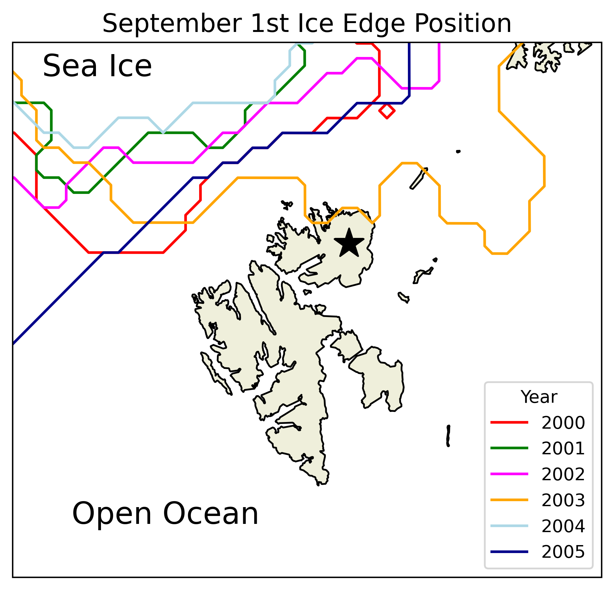
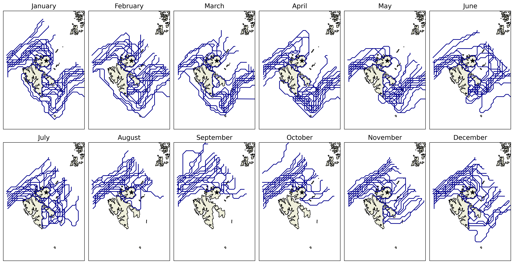
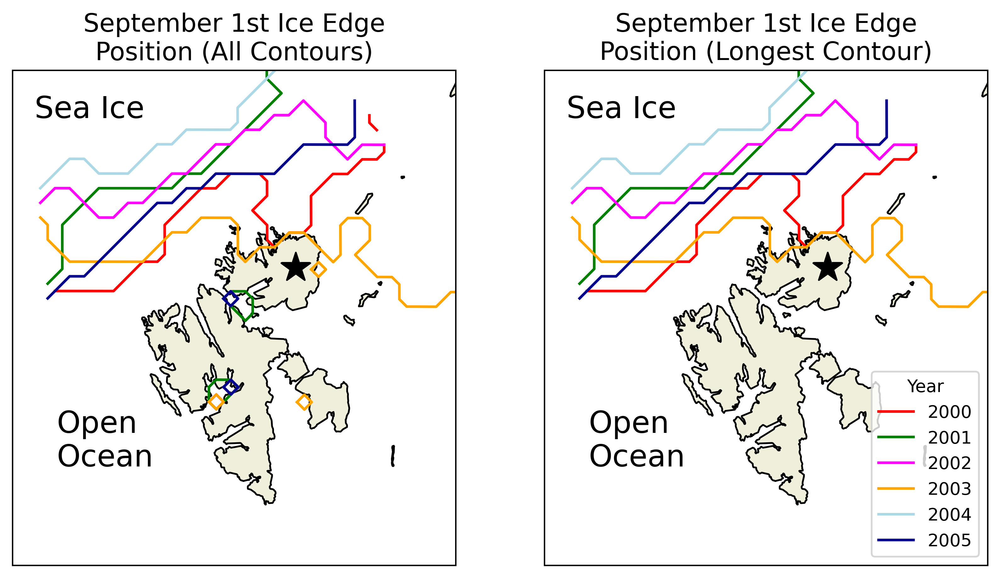
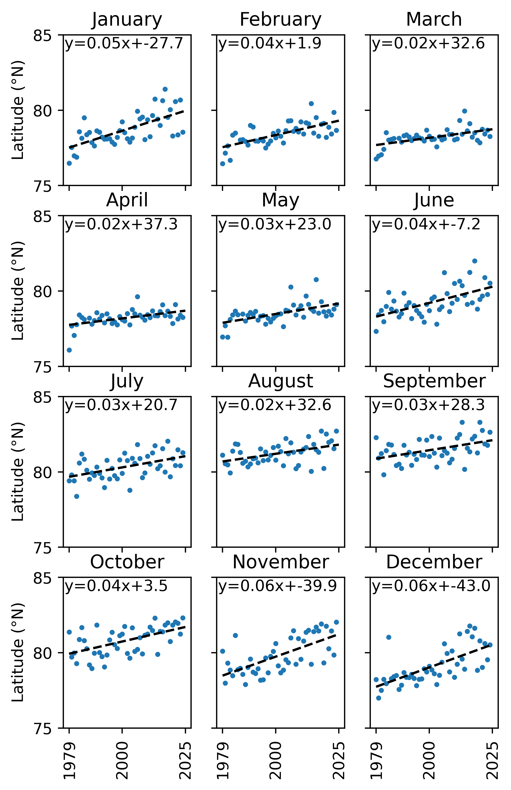
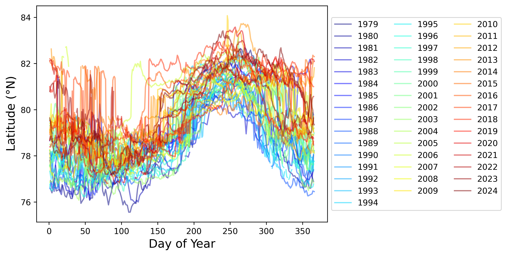

# Ice Edge Index Around Svalbard

This is a dataset (stored in csv format) of the daily 50% concentration sea ice isoline, calculated from the 25 km resolution OSISAF sea ice concentration product ([OSI-420](https://osi-saf.eumetsat.int/products/osi-410-a)). It makes heavy use of [ContourPy](https://contourpy.readthedocs.io/en/v1.3.0/index.html) and the Shapely library. The edges (when calculated) look like this:

One reason to do this analysis in a bespoke way is to avoid jumps in the ice edge related to the inability of a coarse satellite product to resolve sea ice concentration in a few narrow straits. I've fixed this using an interpolation scheme that can be found in the mask_chennels() function of utils.py. Put simply, the algorithm checks whether both sides of a strait are open-water, and then opens the strait if so. This allows contours to flow around the islands and for a more sophisticated ice edge. You can see how the contours go "through" between Spitsbergen and Nordaustlandet in (say) December.

The contour corresponding to the "real" ice edge is determined by the longest contour of the calculated contour in a longitudinal and latitudinal window around Svalbard. Currently for longitude this window is set between 0 and 50E. The shorter contours generally correspond to isolated patches of ice such as those the collect in fjords, as below:

### Some results

It's clear that the ice edge is moving North in all months of the year. 

This is happening at between 0.2 and 0.6 degrees of latitude per year. Each marker in the above figure is the average of the daily ice edge latitude in all days of the month. 

### How it's made

The main file to execute this is calc_COMS_v2.py. It requires utils.py to run, as well as svalbard_mask.p. It should be run in a screen and with the ice_edge conda environment. It's on my todo list to convert this out of pickled format. The routine writes csv files using a number of fixed concentration thresholds as isolines. Importantly, hdf5 files of the actual ice edge are written by get_multi_COM (found in utils.py) if the script is run with output_lines=True. This makes the file quite big - its map projection is EPSG 3408.
